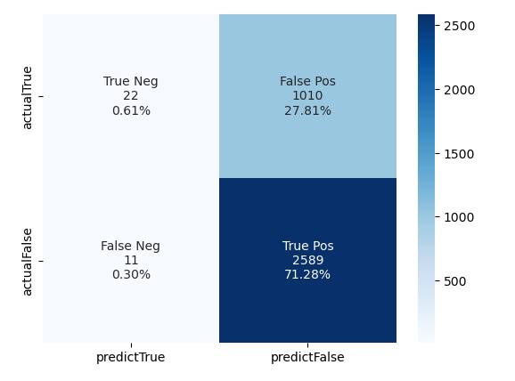

# Loan Defaulter Machine Learning Project
## Overview 
1. **The purpose of the analysis**
	The analysis uses historical data to train and evaluate a model to show how banks collect loans, how they view people's loans and whether they default or do not default on the loans. Our project will discuss the factors that make people default on loans. Also, it will look at the customer’s standard of living, whether they are male or female, income level, education level, and amount of loan they default on.  
2. **About the Data**
	The data is split up into training and testing data. The data here is a large one, it has about 25 columns and about 30,000 rows. It has several columns that the size of the loan, sex, the income level of the borrower, the number of opened accounts, marital status, education level, and the total debt that the borrower has. Also, it has a label showing whether the loan defaults or not. 
3. **Machine Learing Process**
	The Machine Learning Process has features: the size of the loan, sex, the income level of the borrower, the number of opened accounts, marital status, education level, and the total debt that the borrower has.  Also, it has a label that shows the status of the loan and whether people default or do not default on it. Using that data, we can do a first model and an oversampling data. We can calculate the precision, accuracy, and recall level from these two models. 
	* Prepared Data:
	Import data from csv, change the data type, and normalize the data, resampling the data if required(this step is the most important part).
	* Separate the data into features and labels, use train_test_split to separate them into training and testing data set. 
	* Initialize the model.
	* Fitting the model using the training data(X_train, y_train).
	* Use this model to make predictions(use X_test to predict y_predictions).
	* Evaluate the predictions(compare y_predictions and y_test).

4. **Machine Learning Packages**     
```python 
import pandas as pd
import matplotlib.pyplot as plt
import matplotlib.colors as mcolors
import random
from sklearn.metrics import balanced_accuracy_score, confusion_matrix, classification_report
from sklearn.model_selection import train_test_split
from sklearn.preprocessing import StandardScaler
from sklearn.decomposition import PCA
from sklearn.linear_model import LogisticRegression
import numpy as np
import seaborn as sns
``` 
## Machine Learning Results
**First Model**      

1. For accuracy    
Accuracy=(TruePositive+TrueNegative)/(TruePositive+TrueNegative+FalsePositive+FalseNegative)=(2589+22)/(2589+22+1010+11)=71.88%
2. For Percision
Percision=TruePositive/(TruePositive+FalsePositive)=2589/(2589+1010)=71.93%
3. Recall
recall=TruePositive/(TruePositive+FalseNegative)=2589/(2589+11)=99.57%    
**Oversampling Data**       

1. For accuracy    
Accuracy=(TruePositive+TrueNegative)/(TruePositive+TrueNegative+FalsePositive+FalseNegative)=(2589+22)/(2589+22+1010+11)=71.88%
2. For Percision
Percision=TruePositive/(TruePositive+FalsePositive)=2589/(2589+1010)=71.93%
3. Recall
recall=TruePositive/(TruePositive+FalseNegative)=2589/(2589+11)=99.57%   


## Conclusion
The precision for the  class (0) is 100% which means the model correctly made the positive prediction everytime. The recall of that class is 99%.            

The precision for class (1) is not good as expected because the percision is only 84%, but the recall for class (1) is acceptable, it predicted a higher risk sample.       

On the other hand, the previous model recall is 94% and this oversampling recall model is 99%, which means this model has a higher standard because the recall is high. At the new standard, the percision is 84%. 
I recommend using that model because that model has higher accuracy, percision, and recall as shown in the calculation for the first model and for the oversampling data.